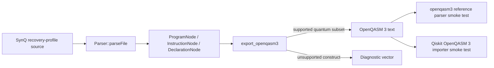
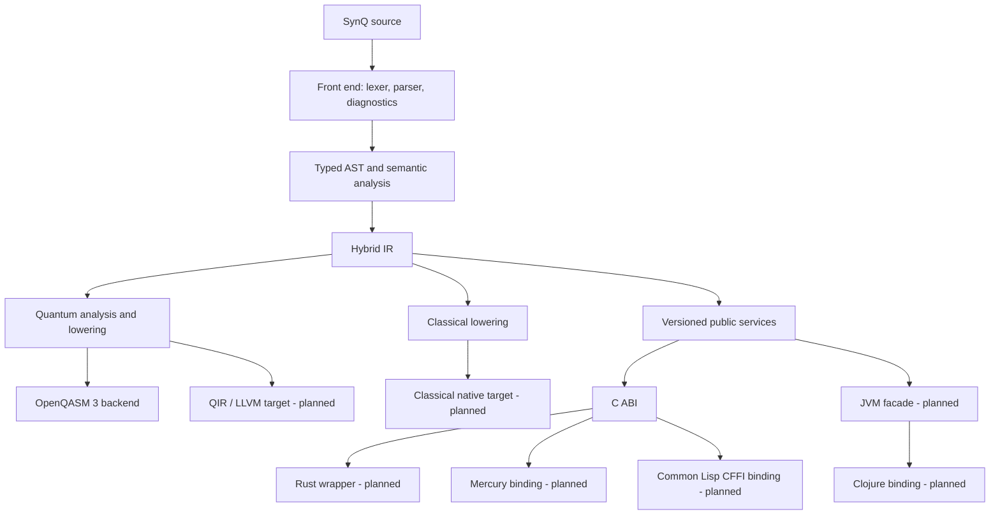
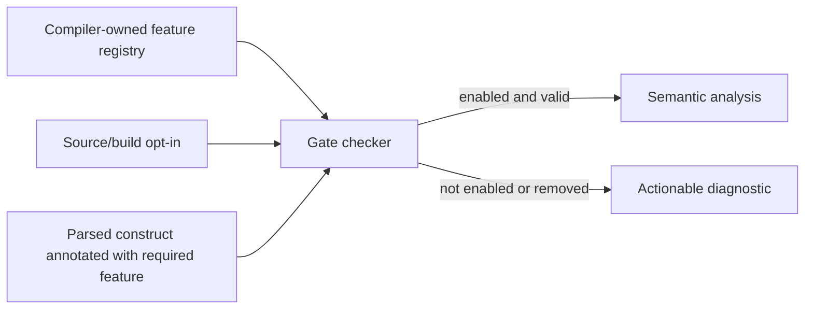

# SynQ Architecture Roadmap

**Status:** A staged architecture plan. Sections labelled **planned** describe
design targets, not implemented subsystems.  
**Author:** Manus AI  
**Last reviewed:** 13 August 2026

## Scope and architectural posture

SynQ is evolving from a recovered compiler core into a hybrid
quantum–classical language kernel. The architecture must support this direction
without representing unfinished historical source folders as working products.
The default CMake profile intentionally excludes incomplete CLI, bindings,
compiler executable, REPL, and experimental subsystems, then builds a static
`synq_lib` and focused core smoke tests.[1]

The roadmap uses the following rule: **a layer is “present” only when its public
contract, test fixture, and supported behavior are all present.** Source files
alone do not satisfy that rule. This keeps the project practical for a solo
maintainer and protects users from assuming the availability of non-default
targets.

## Verified architecture today

The current recovery profile has a compact and useful flow. It is not yet a
full compiler pipeline: it parses a line-oriented source profile into a small
raw-pointer AST and conditionally lowers a limited quantum subset into
OpenQASM 3. Declarations and non-quantum instructions are intentionally
diagnosed as unsupported by that export target rather than silently discarded.



| Component | Current responsibility | Evidence and boundary |
| --- | --- | --- |
| `Parser::parseFile` | Reads files line by line; handles selected declarations, instructions, comments, explicit operands, and literal angles. | The grammar is intentionally small and does not implement expressions, scopes, functions, or execution.[2] |
| `ProgramNode`, `InstructionNode`, `DeclarationNode`, `QuantumGateNode`, `MeasurementNode` | Retain a program as a list of AST-node pointers; parsed quantum statements use a typed gate kind, source name, optional literal angle, numeric operands, and source line; parsed declarations retain source text plus a non-evaluating literal classification; measurements retain one qubit index and provenance. | Function/class nodes, expression syntax, classical types, named result storage, ownership, and a general typed AST remain future work.[3] |
| `export_openqasm3` | Lowers typed quantum nodes to the supported gates (`h`, `x`, `y`, `z`, `cx`, `bell_pair`, `rx`, `ry`, `rz`, `p`) and typed measurements to matching indexed OpenQASM classical bits. | A temporary adapter supports direct legacy instruction fixtures. Unsupported statements/gates yield diagnostics. Export is source generation, not execution.[4] |
| Experimental feature registry | Registers named alpha/beta/stable feature gates; `parameterized-quantum-gates` is an alpha gate. | The recovery parser recognizes an exact file-scoped annotation, rejects unknown annotations, and rejects a gated parameterized kernel without opt-in. Structured warning output and removal records remain future work. |
| C ABI foundation | An opaque-handle C header parses recovery-profile files and exports bounded OpenQASM 3 text. | The ABI has a compiled C smoke consumer and version identifier but is not yet a published or frozen ABI. See [`C_ABI.md`](./C_ABI.md). |
| Core CMake profile | Builds C++17 library sources and registers focused smoke tests by default. | The default options keep historical optional targets off; the current local profile contains seven smoke/interop checks, including external OpenQASM validation and the C ABI consumer.[1] |

The current architecture is therefore a **language seed**: a parser, a minimal
AST, a bounded backend, and independent validation of the emitted text. It is a
sound place to add public contracts, diagnostics, and incremental language
metadata, but not a basis for claiming a general-purpose hybrid runtime.

## Target architecture

The long-term architecture separates language semantics from exchange targets
and host-language adapters. No external SDK or FFI binding may depend directly
on unstable parser classes. The public boundary is a versioned semantic API;
the parser and IR remain implementation details until they have an explicit
stability promise.



### Frontend and diagnostics

The recovery parser is being expanded incrementally rather than by a rewrite.
The first expansion now includes source spans, structured diagnostics with
stable `SYNQ-P001` through `SYNQ-P007` parser/configuration codes, bounded
`SYNQ-S001` through `SYNQ-S003` typed known-gate shape errors, and `SYNQ-S004`
for duplicate top-level declarations. A diagnostic
contains a machine-readable code, severity, source span, plain-language
explanation, and a possible remediation. This is essential for a language
designed to be approachable: an unfamiliar quantum constraint can identify the
exact gate, operand, feature gate, or duplicate binding that caused the
rejection. Tokenisation, multi-error recovery, scoped name resolution, general
semantic analysis, and type diagnostics remain planned work.

| Planned type | Minimum fields | Why it is needed |
| --- | --- | --- |
| `SourceSpan` | current: parser diagnostics and parsed statement AST nodes carry line and one-based half-open columns; future: file identifier and byte positions | Allows precise errors, future HIR provenance, editor integration, and backend rejection attribution. |
| `Diagnostic` | current: code, severity, span, message, help; future: structured note collection | Separates user-facing compiler output from ad hoc `stderr` messages. |
| `Module` | declarations, imports, feature opt-ins, top-level items | Gives a home for edition, gate, and module semantics. |
| `Type` | scalar, boolean, integer, float, angle, bit, qubit, result, function, aggregate variants | Makes the classical–quantum boundary explicit instead of encoding it in strings. |

### Minimal implemented Hybrid IR and planned expansion

The Hybrid IR (HIR) is the central architectural commitment. The current
minimal internal implementation represents already typed parser declarations,
quantum gates, and measurements in source order, preserving source spans and
rejecting retained legacy instructions. Future expansion will make it a typed,
ownership-aware representation after parsing and semantic validation, but before
any backend-specific lowering. HIR is *not* a public ABI; opaque public handles
and serialized artifacts prevent every binding from coupling to internal C++
layout.

| HIR concern | Design direction | Initial invariants |
| --- | --- | --- |
| Classical values | SSA-like values or a clearly scoped equivalent, depending on implementation complexity. | Values carry a type; mutable effects are represented explicitly. |
| Qubit resources | Dedicated quantum handle/type rather than an integer convention. | A quantum operation accepts only allocated/live qubits; measurement produces an explicit classical result boundary. |
| Quantum operations | A small instruction family with gate identifier, typed parameters, ordered operands, and source span. | Backend lowering rejects unsupported gates or parameter domains; it never guesses a replacement. |
| Control and regions | Current: Alpha-gated Boolean-literal or resolver-checked Boolean-identifier `if`/`while` with one typed quantum-or-measurement body. Future: structured blocks for branches, loops, functions, and kernel regions. | The current representation makes bounded classical control visible before target lowering without defining its execution; broader regions remain planned. |
| Provenance | Source span, feature gate, transformation name, and optional AI-suggestion identifier. | A developer can discover whether an operation came from source, a compiler rewrite, or an accepted assistant proposal. |

The implementation will start with the exact constructs that have fixtures.
For example, the current literal-angle `rx(pi/2) q[0]` form can become a typed
`QuantumGate` HIR instruction only after syntax, angle typing, and negative
tests are present. Arbitrary symbolic expressions, gate definitions, dynamic
qubit indexing, and measurement-dependent control remain later design work.

## Experimental feature architecture

The feature system has two roles: it controls access to unstable language
behavior, and it records the provenance needed to retire or stabilize that
behavior safely. It is not a general permissions system and does not authorize
network, hardware, or native-memory operations.



### Planned registry contract

The first code increment is now present as a small C++17 registry with the
fields below. It is intentionally independent of a future package manager,
network service, or issue tracker API. The registry currently has one alpha
feature, `parameterized-quantum-gates`, whose parser enforcement and failure
cases are covered by smoke tests.

| Field | Meaning | Example |
| --- | --- | --- |
| `name` | Permanent machine-readable identifier. | `parameterized-quantum-gates` |
| `stage` | `Alpha`, `Beta`, `Stable`, or eventually `Removed`. | `Alpha` |
| `description` | Short human-readable purpose and risk statement. | `Allows the bounded literal-angle kernel syntax.` |
| `tracking_reference` | Repository issue or design record identifier, not an unverified URL requirement. | `synq#123` |
| `introduced_in` | Compiler or edition version that introduced the record. | `0.x` during pre-release development |
| `default_enabled` | Whether the profile enables the feature without an opt-in. | `false` for Alpha and initial Beta |

The checker will have deterministic outcomes for unknown, disabled, enabled,
stable, and removed names. An alpha use without an opt-in must fail or produce a
diagnostic according to the documented parser/semantic phase; a test will fix
which outcome is implemented. The registry itself is a foundation, not evidence
that all experimental source syntax is accepted.

## C ABI foundation

### Why the C ABI comes first

The C ABI is a practical common denominator, not a claim that C is the language
SynQ is designed around. Rust supports explicit ABI selection for externally
linked functions; Mercury has a documented C foreign language path on
C-compiling backends; CFFI is designed for calling C functions from Common
Lisp; and Clojure’s Java interoperability supports a later JVM facade.[5] [6]
[7] [8]

The public ABI does not expose C++ classes, `std::string`, exceptions,
templates, or ownership that callers have to infer. The initial header at
`compiler/include/synq/synq_ffi.h` exposes an ABI-major constant, opaque
program handles, status codes, UTF-8 path input, and library-owned output freed
by library functions. A C consumer smoke test has compiled and called this
contract locally; the detailed API and limitations are in [`C_ABI.md`](./C_ABI.md).

```c
/* Simplified shape; the header is the exact public source of truth. */
#define SYNQ_ABI_VERSION 1

typedef struct synq_program synq_program;

const char *synq_version(void);
synq_program *synq_parse_file(const char *utf8_path);
int synq_export_openqasm3(const synq_program *program,
                          char **utf8_output,
                          char **utf8_diagnostic);
void synq_string_free(char *value);
void synq_program_free(synq_program *program);
```

The implementation added an explicit status enum and output diagnostic pointers
to make failure and ownership observable in C. The contract remains
experimental until it has a published compatibility policy and CI evidence. A
C smoke test compiled as C and linked against the SynQ library is the current
minimum proof; no Rust wrapper or other language binding is claimed yet.

| ABI rule | Reason |
| --- | --- |
| Every exported function has C linkage and a documented error result. | Prevents callers from depending on C++ name mangling or exception propagation. |
| Public structs are opaque initially. | Allows internal AST/IR changes without ABI breakage and avoids cross-language layout assumptions. |
| All transferred strings are UTF-8 and have explicit allocator ownership. | Avoids implicit locale and allocator-crossing bugs. |
| Callers release output only through `synq_string_free`; programs only through `synq_program_free`. | The allocating library owns the matching deallocation rule. |
| ABI-major changes use a new versioned contract. | Prevents a binding compiled for one layout or signature from silently calling another. |
| Tests are written in the consumer language where possible. | Confirms headers, linkage, calling convention, and ownership rather than just internal C++ behavior. |

## Backend strategy

Backends are outputs from typed HIR rather than extensions of parser text. Each
backend owns a published support matrix and rejects gaps explicitly. The
existing OpenQASM 3 target serves as a bounded starting point; it is not a
promise of arbitrary OpenQASM import, hardware compatibility, or circuit
execution.[4]

| Backend | Status | Near-term role | Evidence required before support claim |
| --- | --- | --- | --- |
| OpenQASM 3 | **Bounded, verified source exporter** | Maintain the supported subset while migrating its input from recovery AST toward HIR. | Exact output fixtures, rejection fixtures, reference parser validation, and Qiskit importer validation. |
| C ABI services | **Remotely validated experimental foundation** | Parse and export services for external native callers. | The compiled C consumer and ownership/error cases passed locally and in [Compiler Core #8][9]. Installation/distribution and a released ABI policy remain future work. |
| LLVM IR / QIR | **Planned research target** | Possible future native classical lowering and quantum IR integration. | A written subset mapping, independent toolchain validation, and no hardware claims. |
| JVM bytecode / facade | **Planned research target** | A Java-facing service layer for Clojure and other JVM users. | JVM build/test matrix, explicit native-loading behavior if JNI is used, and a Clojure invocation test. |
| AI transformation API | **Not designed as an execution backend** | Future opt-in analysis or proposal interface. | Provenance, deterministic validation path, user acceptance boundary, and security review appropriate to the concrete capability. |

## Milestones and exit criteria

The milestones below are ordered by technical dependency. They are not effort
or date estimates.

| Stage | Primary deliverable | Exit criteria |
| --- | --- | --- |
| **0 — Recovery (complete)** | Recovered compiler-core profile and bounded OpenQASM export. | Current CMake smoke profile and documented external parser/import validation pass. |
| **1 — Foundation** | Experimental-gate registry, initial parser enforcement, C ABI header and C smoke consumer. | Local enabled/disabled/unknown gate tests and C consumer calls now pass. The stage completes only after full project validation, evidence recording, commit, and CI publication. |
| **2 — Typed hybrid core** | Structured diagnostics, typed AST, HIR, basic classical expressions/control, explicit measurement/result boundary. | Parser, type, lowering, and negative fixtures exercise every public construct in the selected subset. |
| **3 — Native adapters** | Rust wrapper first, then tested Mercury and Common Lisp adapters where toolchains are available in CI. | Each adapter has a build fixture and calls exactly the released C ABI; no adapter reaches C++ internals. |
| **4 — JVM adapter** | Java facade and Clojure use case. | A JVM test and a Clojure consumer test verify version reporting, parsing, diagnostics, and artifact export. |
| **5 — Research expansion** | Additional backends, optimizer work, and opt-in AI assistance. | Each feature has a safety stage, tracking record, test suite, capability statement, and an explicit removal/graduation path. |

## Quality gates and maintenance discipline

Every increment must keep the recovery profile buildable with CMake and retain
the existing frontend and backend checks when they are unrelated to the change.
New language work must add both positive and negative tests: acceptance alone
does not prove that invalid syntax, disabled feature gates, ABI misuse, or
unsupported backend operations fail safely.

The language foundation will only be published after the following evidence is
recorded in the repository: exact commands, tool versions where relevant,
passing output, limitations, and links to CI run results. If a target toolchain
cannot be available in free CI, the corresponding binding remains experimental
and the documentation names the unverified environment rather than generalizing
from a single local build.

## References

[1]: https://github.com/TangoSplicer/SynQ/blob/ceaa971/compiler/CMakeLists.txt "SynQ compiler CMake recovery profile"
[2]: https://github.com/TangoSplicer/SynQ/blob/ceaa971/compiler/src/compiler/parser.cpp "SynQ recovery parser source"
[3]: https://github.com/TangoSplicer/SynQ/blob/ceaa971/compiler/src/compiler/ast.h "SynQ recovery AST source"
[4]: https://github.com/TangoSplicer/SynQ/blob/ceaa971/compiler/src/compiler/openqasm3_exporter.cpp "SynQ OpenQASM 3 exporter source"
[5]: https://doc.rust-lang.org/reference/abi.html "The Rust Reference: Application binary interface"
[6]: https://mercurylang.org/information/doc-release/mercury_user_guide/Foreign-language-interface.html "The Mercury User’s Guide: Foreign language interface"
[7]: https://cffi.common-lisp.dev/manual/cffi-manual.html "CFFI User Manual"
[8]: https://clojure.org/reference/java_interop "Clojure Java Interop"
[9]: https://github.com/TangoSplicer/SynQ/actions/runs/31718265429 "SynQ Compiler Core #8"
